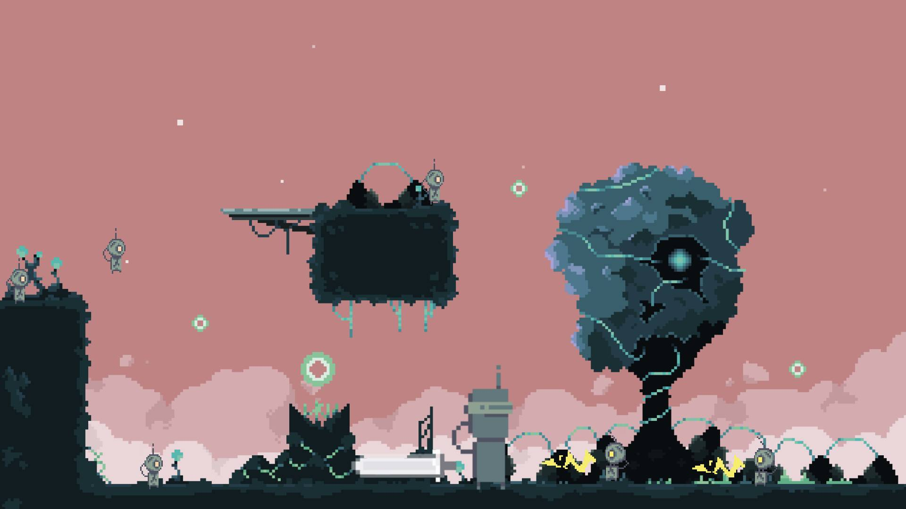

# robots-love-pizza

# Robots Love Pizza

This is a game where you play as our hero robot Timmy, and he loves pizza. Fight a horde of robots
to increase your score and eat the pizza the fallen enemies have dropped. As the timer goes on the enemies will spawn at higher frequencies. If Timmy the pizza loving robot gets hit 3 times, it is game over.

## Image Mock-up Wireframe

---

## MVP Goals

- Create a BG canvas
- Create Hero and render him in the middle of the canvas (determine which direction the hero is facing)
- Bind walking, jumping, and attack keys (arrow keys for walking, a for attack, and spacebar to jump)
- Create wall collision detection (edge of canvas detection)
- Create an enemy and render them on the canvas
- Create attack and hit detection with a second asset (weapon)
- Spawn enemies from side of canvas
- Add a you died screen

## Stretch Goals

- Add up score
- Add power-ups
- Insert BG
- Insert Sprites
- Insert Music
- Add a start button & reset

## Potential Roadblocks

- Figuring out which direction the hero is facing
- Implementing atk hit detection
